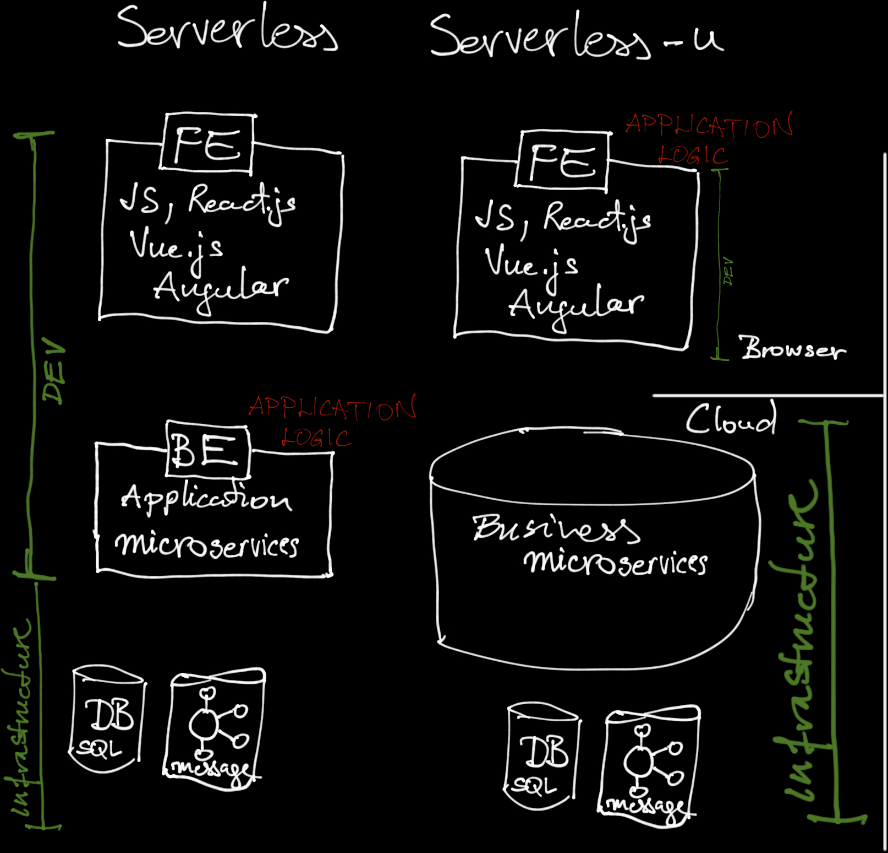

= Serverless-u, enabling pure front-end development

== Introduction

This project aims to enable pure serverless applications.
Serverless applications contain front-end (FE) and back-end (BE) code, and run in the browser (FE) and in the cloud (BE) using cloud services, like a database, messaging, etc.

Pure serverless applications contain only FE code, and they run in the browser using cloud services like authentication, access control, document access and search, structural data storage, etc.

link:architecture.png[]

The major difference between serverless and serverless-u is that serverless-u extends  serverless to the development.
Serverless architecture is serverless in the runtime, but the development still needs code developed for the cloud.
Serverless-u provides general business services that you can configure and install in the cloud and develop your application using only FE technologies.

This github repo contains microservice applications that you can deploy in the cloud and create FE applications that use these services without any further server code development.

=== Advantages and Disadvantages of Serverless-u

Serverless-u is not the Saint Graal of the application development.
There are some applications where serverless-u is the answer and there are some where it is not.
There are also some situations where you can mix serverless-u and serverless application development.

When deciding to use serverless-u, you have to consider the advantages and disadvantages together.

=== Advantages

If you develop your application using only FE technologies, you can:

* *Develop your application faster.*
+
You can develop your code, and any change in the code is immediately available for testing and to play with.
Front-end development is usually faster than back-end development.

* *Secure development*
+
Since you develop only FE code, which runs in a non-trusted environment, development can produce less security risks compared to server development.

* *Develop your application cheaper*
+
Faster development usually also means cheaper, but the developer pool for FE developers is also larger than for BE developers.
It also has an impact on the development and maintenance costs.

* *Undeployed code*
+
The code runs in the browser.
There is no need for deployment; perhaps a simple content server can serve the HTML, CSS and JS components.

=== Disadvantages

There are disadvantages of the serverless-u approach:

* *Limited functionality*
+
Serverless-u can only perform functions that can be composed of the available Business Services.
If you do not find a service that you need, you have to develop it yourself.
That may be a mixed serverless-u and serverless application development.

* *Communication overhead*
+
Since serverless-u components are autonomous and do not communicate with each other, the client code has to implement the communication between the components.
This makes the client code more complex than a conventional serverless application when the same complexity is developed as part of the server code.

* *Performance*
+
Since the business services are general applications they are not fine tuned to the specific business needs of the application.
This may lead to performance issues.

== Serverless-u Architecture

We can call an architecture serverles-u with the following main characteristics:

=== General Business Services

The services are general business services that can be configured and installed in the cloud.
The service are

* *general*, meaning that they can be used in many applications and not tuned to serve some specific business application's need, and

* *business*, meaning that they are not simply infrastructure services like a database service.

An example is a document service that stores documents in a NoSQL database.
This service can be used in many applications, but it is not a general infrastructure service.
On the other end, it is also not an invoice processing system storing and modifying invoices, or a contract database.
It stores documents in a backing document database like MongoDB and provides some extra business functionality.

The extra functionality, which is usually the part of most serverless-u business services can be the access control enforcement.
It can be on the document level separating who can create, delete, modify and read individual documents, but it can also be on the individual field level.
This is the business part of the service.

The business services provide REST interface and can be used by any FE application that can communicate with the REST interface.

=== Granular Services

Services are small and focus on a single business functionality.
Many times business functionalities implemented in a single unit are split into different services.
An example is access control authorization.

In monolithic and conventional serverless applications authorization is part of the application code.
The application decides who can do what.
If you do not have the right to perform some operation, the application will not allow you to do it.

In serverless-u the authorization is split into two functionalities.
One is authorization logic, and the other is access control enforcement.

Access control enforcement is implemented in each individual business service.
If the business service does not stop someone doing something they are not supposed to do, then no one will.
The decision, however, can be implemented by a separate service.
This service makes a decision based on the information it got from the FE and gives an advice that he business service will enforce.

Another example is an archival service.
Conventionally archiving is part of the application code.
It can utilize other services, but it is the function of the application.

In serverless-u the application may "ask" the FE application to archive some data.
It may or may not require the FE application to confirm the archiving, and there also may be some other conditions that have to be met.
Splitting the archiving from the core of the application code is not simple, but it is possible.

Generally, the services are as granular as it makes sense to provide general functionality usable by multiple of applications.

=== Independent Services

Server-u services are independent.
They should not directly communicate with each other.
The communication between the services is done by the FE application.

This architectural feature makes these services scalable and independent.
They can be deployed in different cloud providers, on different network segments that cannot even communicate with each other.
The only requirement is that they are reachable using REST from the client.

=== PKI

Since the services do not communicate with each other, the architecture heavily relies on the Public Key Infrastructure (PKI).
Whenever the client wants to access some service, it has to provide certified tickets proving all preconditions are met.
For example, the client wants to delete a document.
The document server issues a ticket that the client needs to present to the access control service.
The access control service replies with another ticket that grands the deletion of the document.
Finally the client goes back to the document service and presents the ticket that allows the deletion of the document.

NOTE: The client never signs or verifies a ticket, it only passes it on from one service to another.

To do this successfully, the servers should be able to sign and verify the different ticket.

== Planned Services, Roadmap

In this section we list the planned and implemented services.
These are general business services that can be used in many applications.

=== ᚨᚷᛋᛖᛋᛋᚷᚨᚱᛞ https://github.com/serverless-u/AxsessGard[AxsessGard] `MVP`

AxsessGard is the authorization service.

==== DocumentService `Planned`

==== Archival Service `Planned`

==== Janus-txbs `Planned`

==== Tree Navigational Service `Planned`

==== Workflow Service `Planned`

== Contribution

 Join the Adventure! 🚀 We're on a mission to create these services, and we need YOUR skills! There are many ways to contribute:

How you can help:

- 💻 Code new services or fix bugs
- 📝 Improve or write documentation
- 🐛 Test the project and report issues
- 💡 Suggest new features or enhancements
- 🎨 Create FE application for the services' maintenance interfaces, or
- 🖌️ application using the existing services.
- 📣 Spread the word and advocate for the project
- 🌍 Help with translations
- 💬 Answer questions and support other users

Why contribute?

- 🌟 Make a real impact on [project's potential influence]
- 🧠 Sharpen your skills on cutting-edge tech
- 🤝 Connect with a vibrant community of like-minded developers

Ready to dive in? Here's how:
1. Check out open issues
2. Fork the repo
3. Make your contribution
4. Submit a pull request

No contribution is too small. Let's build something amazing together!

== License is Apache 2.0

The individual repositories should contain a LICENSE.txt file showing that the code is licensed under the Apache 2.0 license.